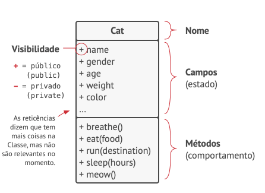

# Programação Orientada a Objetos

A programação orientada a objetos (POO) é um paradigma de programação que organiza o código em torno de objetos, que são instâncias de classes. Na POO, os objetos possuem propriedades (atributos) e comportamentos (métodos), e interagem entre si através de mensagens. Esse paradigma promove a reutilização de código, modularidade, encapsulamento e abstração, tornando o desenvolvimento de software mais eficiente e escalável.

Além disso, a POO permite a criação de hierarquias de classes através de herança, onde uma classe pode herdar características de outra classe. Isso facilita a criação de código mais organizado e facilita a manutenção e extensão do software.

Outro conceito importante na POO é o polimorfismo, que permite que objetos de diferentes classes sejam tratados de forma uniforme. Isso possibilita a criação de código mais flexível e genérico, facilitando a implementação de funcionalidades adicionais.

Em resumo, a programação orientada a objetos é uma abordagem poderosa para o desenvolvimento de software, oferecendo diversas vantagens em termos de organização, reutilização de código e flexibilidade.
